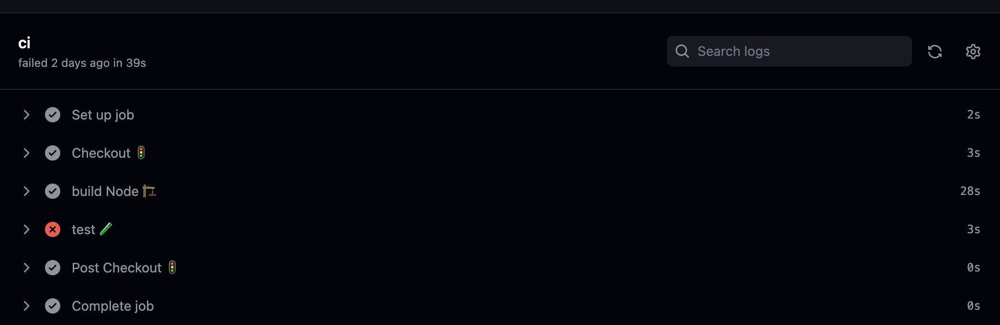
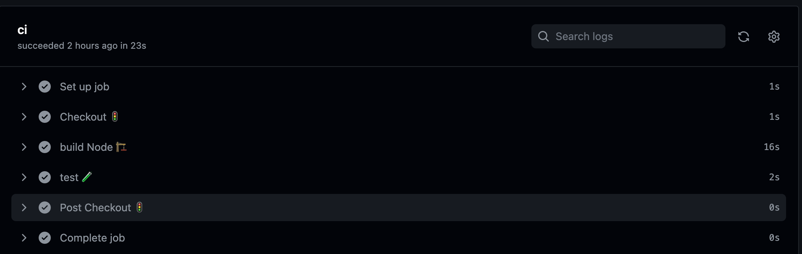

### CI 

# Ejercicio 1. Crea un workflow CI para el proyecto de frontend
Para este primer ejercicio, añadimos en el la raiz del proyecto un nuevo directorio `.github/workflows`, que contendra el `.yaml` donde definiremos nuestro workflow. 

```
name: CI
on:
  pull_request:
    branches:
      - main
jobs:
  ci:
    runs-on: ubuntu-latest
    steps:
      - name: Checkout 🚦
        uses: actions/checkout@v3
      
      - name: Build 🏗
        working-directory: ./hangman-front
        run: |
          npm ci 
          npm run build --if-present

      - name: Unit test 🧪
        working-directory: ./hangman-front
        run: npm test
```

Al ejecutar la build vemos que todos los steps se realizan correctamente a excepcion de los test , dado que uno de los test falla y por lo tanto el step de test es fallido igualmente.



Si queremos que los test pasen, actualizamos el assert del test `start-game.spec.tsx` para que este pase:

```
 expect(items).toHaveLength(2); 
 ```

y vemos como ya todos los pasos de nuestro workflow pasan correctamente 




# Ejercicio 2. Crea un workflow CD para el proyecto de frontend
Una vez tenemos nuestro workflow del ejercicio 1 definido, partiendo de este construiremos el workflow del ejercicio 2.

