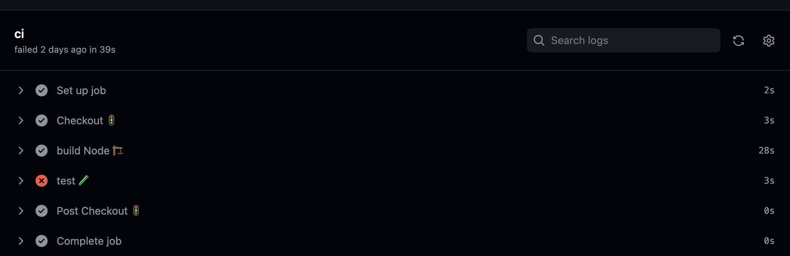

### CI 

# Ejercicio 1. Crea un workflow CI para el proyecto de frontend
Para este primer ejercicio, añadimos en el la raiz del proyecto un nuevo directorio `.github/workflows`, que contendrá el `.yaml` donde definiremos nuestro workflow. 
En primer lugar configuramos la build de modo que el trigger para que se ejecute la CI sea al realizar una pull request hacia nuestra rama principal `main`.

```
on:
  pull_request:
    branches:
      - main

```

Una vez definido. creamos los jobs que queremos realizar cuando se produzcqa el trigger. En nuestro caso se lanzará un job que contiene una serie de steps. En primer lugar, hacemos un checkout de nuestro codigo mediante la action `actions/checkout@v3` para poder tener el codigo de nuestro repositorio.

```
    - name: Checkout 🚦
      uses: actions/checkout@v3
    - name: Setup Node 🔧
      uses: actions/setup-node@v3
```

El siguiente paso sera compilar nuestro codigo y para ello ejecutaremos los comandos de npm para instalar las dependencias necesarias y construir nuestro proyecto, mediante la instruccion `run`

```
    - name: Build 🏗
      working-directory: ./hangman-front
      run: |
       npm ci 
       npm run build --if-present
```

Por último ejecutaremos los tests unitarios del mismo modo que en el step anterior peru ejecutando la instruccion `npm run`

```
    - name: Unit test 🧪
      working-directory: ./hangman-front
      run: npm test
```


De modo que asi queda construido nuestro archivo de integración continua `ci.yaml`
```
name: CI
on:
  pull_request:
    branches:
      - main
jobs:
  ci:
    runs-on: ubuntu-latest
    steps:
      - name: Checkout 🚦
        uses: actions/checkout@v3
      - name: Setup Node 🔧
        uses: actions/setup-node@v3
      
      - name: Build 🏗
        working-directory: ./hangman-front
        run: |
          npm ci 
          npm run build --if-present

      - name: Unit test 🧪
        working-directory: ./hangman-front
        run: npm test
```

Al ejecutar la build vemos que todos los steps se realizan correctamente a excepcion de los test , dado que uno de los test falla y por lo tanto el step de test es fallido igualmente.



Si queremos que los test pasen, actualizamos el assert del test `start-game.spec.tsx` para que este pase:

```
 expect(items).toHaveLength(2); 
 ```

y vemos como ya todos los pasos de nuestro workflow pasan correctamente.


# Ejercicio 2. Crea un workflow CD para el proyecto de frontend


Creamos un nuevo archivo `.yaml` llamado `.cd-docker`. En este archivo, al igual que en el ejercicio 1 necesitamos ejecutar la build del proyecto por lo que creamos un job que realize este paso : 

```
```