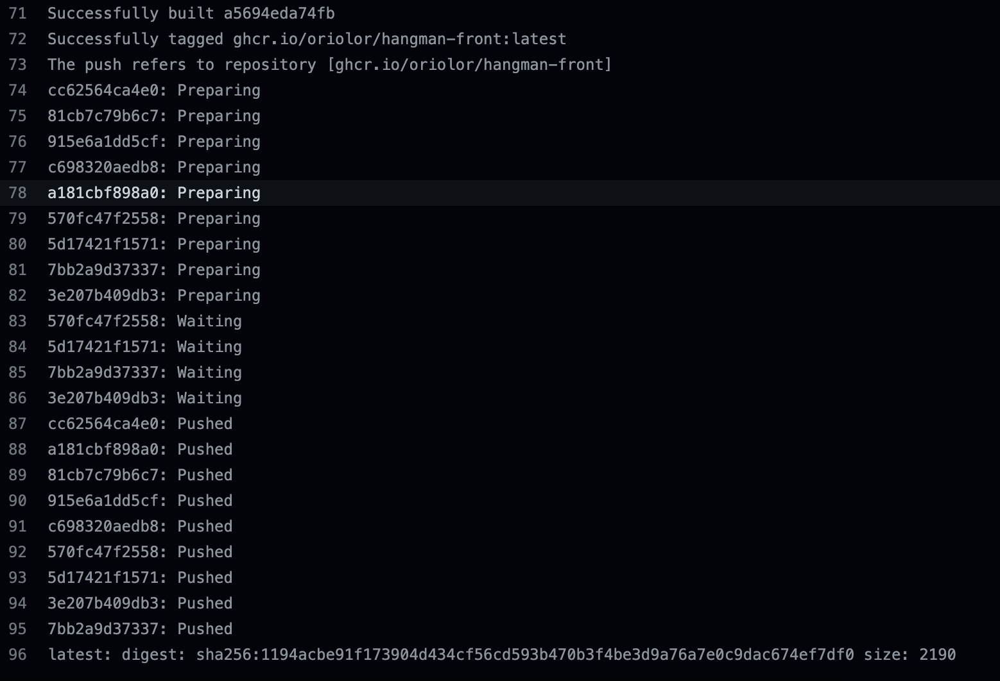

### CI 

# Ejercicio 1. Crea un workflow CI para el proyecto de frontend
Para este primer ejercicio, añadimos en el la raiz del proyecto un nuevo directorio `.github/workflows`, que contendrá el `.yaml` donde definiremos nuestro workflow. 
En primer lugar configuramos la build de modo que el trigger para que se ejecute la CI sea al realizar una pull request hacia nuestra rama principal `main`.

```
on:
  pull_request:
    branches:
      - main

```

Una vez definido. creamos los jobs que queremos realizar cuando se produzcqa el trigger. En nuestro caso se lanzará un job que contiene una serie de steps. En primer lugar, hacemos un checkout de nuestro codigo mediante la action `actions/checkout@v3` para poder tener el codigo de nuestro repositorio.

```
    - name: Checkout 🚦
      uses: actions/checkout@v3
    - name: Setup Node 🔧
      uses: actions/setup-node@v3
```

El siguiente paso sera compilar nuestro codigo y para ello ejecutaremos los comandos de npm para instalar las dependencias necesarias y construir nuestro proyecto, mediante la instruccion `run`

```
    - name: Build 🏗
      working-directory: ./hangman-front
      run: |
       npm ci 
       npm run build --if-present
```

Por último ejecutaremos los tests unitarios del mismo modo que en el step anterior peru ejecutando la instruccion `npm run`

```
    - name: Unit test 🧪
      working-directory: ./hangman-front
      run: npm test
```


De modo que asi queda construido nuestro archivo de integración continua `ci.yaml`
```
name: CI
on:
  pull_request:
    branches:
      - main
jobs:
  ci:
    runs-on: ubuntu-latest
    steps:
      - name: Checkout 🚦
        uses: actions/checkout@v3
      - name: Setup Node 🔧
        uses: actions/setup-node@v3
      
      - name: Build 🏗
        working-directory: ./hangman-front
        run: |
          npm ci 
          npm run build --if-present

      - name: Unit test 🧪
        working-directory: ./hangman-front
        run: npm test
```

Al ejecutar la build vemos que todos los steps se realizan correctamente a excepcion de los test , dado que uno de los test falla y por lo tanto el step de test es fallido igualmente.


Si queremos que los test pasen, actualizamos el assert del test `start-game.spec.tsx` para que este pase:

```
 expect(items).toHaveLength(2); 
 ```

y vemos como ya todos los pasos de nuestro workflow pasan correctamente.


# Ejercicio 2. Crea un workflow CD para el proyecto de frontend


Creamos un nuevo archivo `.yaml` llamado `.cd-docker`. En este archivo, al igual que en el ejercicio 1 necesitamos ejecutar la build del proyecto por lo que creamos un job que realize este paso : 


En primer lugar definimos que el trigger de la build va a ser manual mediante `wor kflow_dispatch`.

```
on:
 workflow_dispatch:

```

Creamos un job para la build donde generaremos nuestro artefacto que será posteriormente usado en la construccion de la imagen de docker
```  
build: 
  runs-on: ubuntu-latest
  steps: 
    - name: Checkout 🚦
      uses: actions/checkout@v3 
    - name: Setup Node 🔧
      uses: actions/setup-node@v3
      
    - name: Build 🏗
      working-directory: ./hangman-front
      run: |
        npm ci 
        npm run build --if-present

    - name: Upload artifact 📦
      uses: actions/upload-artifact@v3 
      with:
        name: build-code
        path: hangman-front/dist/
```
Añadimos dentro den proyecto de `hangman-front` el  archivo `Dockerfile.workflow` que utilizaremos para 

El siguiente paso sera crear el job para que podamos hacer build de nuestra imagen de docker y publicarla en el registro de packetes de github. En primer lugar es necesario hacer login al container regristry de GitHub. 

```
echo "${{ secrets.DOCKER_TOKEN }}" | docker login ghcr.io -u "${{ github.actor }}" --password-stdin
```

COnfiguramos el nombre de la imagen teniendo en cuenta el usuario y el repositorio. Seguidamente hacemos build de la imagen.
```
dockerImage=ghcr.io/$DOCKER_USER/$DOCKER_REPOSITORY
docker build . --file Dockerfile.workflow -t $dockerImage:latest
```

FInalmente cuando el proceso de build se ha realizado correctamente publicamos nuestra imagen en el container registry de GitHub.

```
docker push $dockerImage:latest
```

Ejecutamos la pipeline manualmente y comprovamos como todos los pasos se han realizado correctaente



Codigo completo de `cd-docker.yaml`.

```
name: CD-Docker
on:
 workflow_dispatch:

jobs: 
  build: 
    runs-on: ubuntu-latest
    steps: 
      - name: Checkout 🚦
        uses: actions/checkout@v3 
      - name: Setup Node 🔧
        uses: actions/setup-node@v3
      
      - name: Build 🏗
        working-directory: ./hangman-front
        run: |
          npm ci 
          npm run build --if-present

      - name: Upload artifact 📦
        uses: actions/upload-artifact@v3 
        with:
          name: build-code
          path: hangman-front/dist/
         
  deploy : 
    runs-on: ubuntu-latest
    needs: build 

    steps : 
      - name: Checkout 🚦
        uses: actions/checkout@v3
      
      - name: Dowload Artifact 📦
        uses: actions/download-artifact@v3 
        with: 
         name: build-code 
         path: hangman-front/dist/

      - name: Build Docker Image 🐳
        working-directory: ./hangman-front
        env: 
          DOCKER_USER: "oriolors"
          DOCKER_REPOSITORY: "hangman-front"
        run: |
          echo "${{ secrets.DOCKER_TOKEN }}" | docker login ghcr.io -u "${{ github.actor }}" --password-stdin
          dockerImage=ghcr.io/$DOCKER_USER/$DOCKER_REPOSITORY
          docker build . --file Dockerfile.workflow -t $dockerImage:latest
          docker push $dockerImage:latest

```